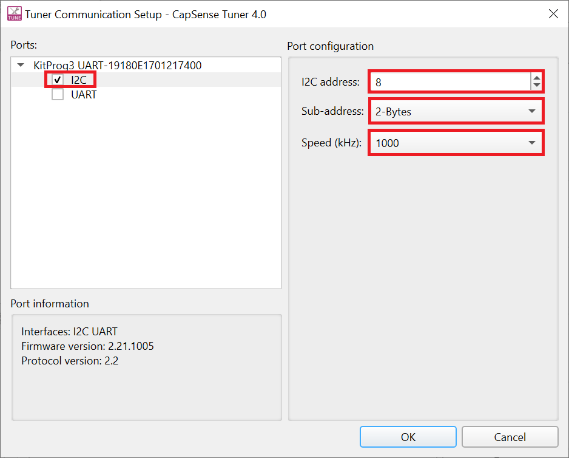
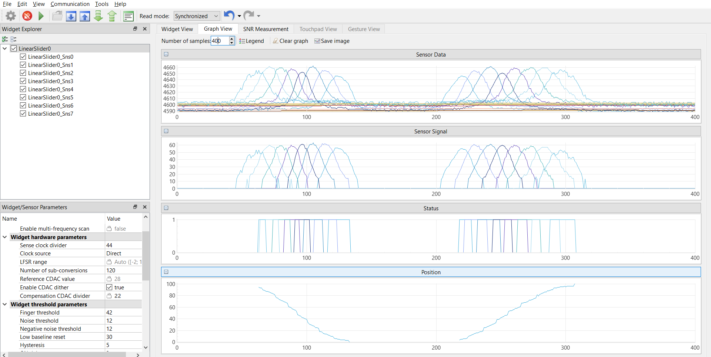
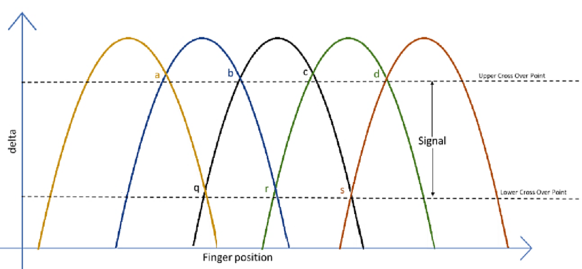

# PSoC&trade; 4: MSC self-capacitance slider tuning

This code example demonstrates how to use the CAPSENSE&trade; middleware to detect a finger touch position on a self-capacitance-based Slider widget in PSoC&trade; 4 devices with multi sense converter (MSC).

In addition, this Readme also explains how to manually tune the self-capacitance-based Slider for optimum performance with respect to parameters such as reliability, power consumption, response time and linearity using the CSD-RM sensing technique and CAPSENSE&trade; Tuner GUI. Here, CAPSENSE&trade; sigma delta (CSD) represents the self-capacitance sensing technique and RM represents the ratiometric method.

[View this README on GitHub.](https://github.com/Infineon/mtb-example-psoc4-msc-capsense-csd-slider-tuning)

[Provide feedback on this code example.](https://cypress.co1.qualtrics.com/jfe/form/SV_1NTns53sK2yiljn?Q_EED=eyJVbmlxdWUgRG9jIElkIjoiQ0UyMzI3NzYiLCJTcGVjIE51bWJlciI6IjAwMi0zMjc3NiIsIkRvYyBUaXRsZSI6IlBTb0MmdHJhZGU7IDQ6IE1TQyBzZWxmLWNhcGFjaXRhbmNlIHNsaWRlciB0dW5pbmciLCJyaWQiOiJqb2JpIiwiRG9jIHZlcnNpb24iOiIxLjAuMCIsIkRvYyBMYW5ndWFnZSI6IkVuZ2xpc2giLCJEb2MgRGl2aXNpb24iOiJNQ0QiLCJEb2MgQlUiOiJJQ1ciLCJEb2MgRmFtaWx5IjoiUFNPQyJ9)

## Requirements

- [ModusToolbox&trade; software](https://www.cypress.com/products/modustoolbox-software-environment) v2.4

  **Note:** This code example version requires ModusToolbox&trade; software version 2.4 or later and is not backward compatible with v2.3 or older versions.

- Board support package (BSP) minimum required version: 2.0.0 
- Programming language: C
- Associated parts: [PSoC&trade; 4100S Max](https://www.cypress.com/documentation/datasheets/psoc-4-psoc-4100s-max-datasheet-programmable-system-chip-psoc)

## Supported toolchains (make variable 'TOOLCHAIN')

- GNU Arm® embedded compiler v10.3.1 (`GCC_ARM`) - Default value of `TOOLCHAIN`
- Arm&reg; compiler v6.13 (`ARM`)
- IAR C/C++ compiler v8.42.2 (`IAR`)


## Supported kits (make variable 'TARGET')

- [CY8CKIT-041S-MAX PSoC&trade; 4100S Max pioneer kit](https://www.cypress.com/documentation/development-kitsboards/psoc-4100s-max-pioneer-kit-cy8ckit-041s-max) (`CY8CKIT-041S MAX`) - Default target

## Hardware setup

This example uses the board's default configuration. See the [kit user guide](https://www.cypress.com/file/520036/download) to ensure that the board is configured correctly to V<sub>DDA</sub> at 5V (J10 should be at position 1 and 2). If you are using the code example at a V<sub>DDA</sub> voltage other than 5 V, ensure to set up the device power voltages correctly for the proper operation of the device power domains.  See [Steps to setup the V<sub>DDA</sub> supply voltage in Device Configurator](#steps-to-setup-the-vdda-supply-voltage-in-device-configurator) for more details.


## Software setup

This example requires no additional software or tools.


## Using the code example

Create the project and open it using one of the following:

<details><summary><b>In Eclipse IDE for ModusToolbox&trade; software</b></summary>

1. Click the **New Application** link in the **Quick Panel** (or, use **File** > **New** > **ModusToolbox Application**). This launches the [Project Creator](https://www.cypress.com/ModusToolboxProjectCreator) tool.

2. Pick a kit supported by the code example from the list shown in the **Project Creator - Choose Board Support Package (BSP)** dialog.

   When you select a supported kit, the example is reconfigured automatically to work with the kit. To work with a different supported kit later, use the [Library Manager](https://www.cypress.com/ModusToolboxLibraryManager) to choose the BSP for the supported kit. You can use the Library Manager to select or update the BSP and firmware libraries used in this application. To access the Library Manager, click the link from the **Quick Panel**.

   You can also just start the application creation process again and select a different kit.

   If you want to use the application for a kit not listed here, you may need to update the source files. If the kit does not have the required resources, the application may not work.

3. In the **Project Creator - Select Application** dialog, choose the example by enabling the checkbox.

4. (Optional) Change the suggested **New Application Name**.

5. The **Application(s) Root Path** defaults to the Eclipse workspace which is usually the desired location for the application. If you want to store the application in a different location, you can change the *Application(s) Root Path* value. Applications that share libraries should be in the same root path.

6. Click **Create** to complete the application creation process.

For more details, see the [Eclipse IDE for ModusToolbox&trade; software user guide](https://www.cypress.com/MTBEclipseIDEUserGuide) (locally available at *{ModusToolbox&trade; software install directory}/ide_{version}/docs/mt_ide_user_guide.pdf*).

</details>

<details><summary><b>In command-line interface (CLI)</b></summary>

ModusToolbox&trade; software provides the Project Creator as both a GUI tool and the command line tool, "project-creator-cli". The CLI tool can be used to create applications from a CLI terminal or from within batch files or shell scripts. This tool is available in the *{ModusToolbox&trade; software install directory}/tools_{version}/project-creator/* directory.

Use a CLI terminal to invoke the "project-creator-cli" tool. On Windows, use the command line "modus-shell" program provided in the ModusToolbox&trade; software installation instead of a standard Windows command-line application. This shell provides access to all ModusToolbox&trade; software tools. You can access it by typing `modus-shell` in the search box in the Windows menu. In Linux and macOS, you can use any terminal application.

This tool has the following arguments:

Argument | Description | Required/optional
---------|-------------|-----------
`--board-id` | Defined in the `<id>` field of the [BSP](https://github.com/Infineon?q=bsp-manifest&type=&language=&sort=) manifest | Required
`--app-id`   | Defined in the `<id>` field of the [CE](https://github.com/Infineon?q=ce-manifest&type=&language=&sort=) manifest | Required
`--target-dir`| Specify the directory in which the application is to be created if you prefer not to use the default current working directory | Optional
`--user-app-name`| Specify the name of the application if you prefer to have a name other than the example's default name | Optional

<br>

The following example will clone the "[Hello World](https://github.com/Infineon/mtb-example-psoc4-hello-world)" application with the desired name "MyHelloWorld" configured for the *CY8CKIT-041S-MAX* BSP into the specified working directory, *C:/mtb_projects*:

   ```
   project-creator-cli --board-id CY8CKIT-041S-MAX --app-id mtb-example-psoc4-hello-world --user-app-name MyHelloWorld --target-dir "C:/mtb_projects"
   ```

**Note:** The project-creator-cli tool uses the `git clone` and `make getlibs` commands to fetch the repository and import the required libraries. For details, see the "Project creator tools" section of the [ModusToolbox&trade; software user guide](https://www.cypress.com/ModusToolboxUserGuide) (locally available at *{ModusToolbox&trade; software install directory}/docs_{version}/mtb_user_guide.pdf*).

</details>

<details><summary><b>In third-party IDEs</b></summary>

Use one of the following options:

- **Use the standalone [Project Creator](https://www.cypress.com/ModusToolboxProjectCreator) tool:**

   1. Launch Project Creator from the Windows Start menu or from *{ModusToolbox&trade; software install directory}/tools_{version}/project-creator/project-creator.exe*.
   2. In the initial **Choose Board Support Package** screen, select the BSP and click **Next**.
   3. In the **Select Application** screen, select the specific IDE from the **Target IDE** drop-down menu.
   4. Click **Create** and follow the instructions printed in the bottom pane to import or open the exported project in the respective IDE.

<br> 

- **Use command-line interface (CLI):**

   1. Follow the instructions from the **In command-line interface (CLI)** section to create the application, and then import the libraries using the `make getlibs` command.

   2. Export the application to a supported IDE using the `make <ide>` command.

   3. Follow the instructions displayed in the terminal to create or import the application as an IDE project.

For a list of supported IDEs and more details, see the "Exporting to IDEs" section of the [ModusToolbox&trade; software user guide](https://www.cypress.com/ModusToolboxUserGuide) (locally available at *{ModusToolbox&trade; software install directory}/docs_{version}/mtb_user_guide.pdf*).

</details>

The project has the necessary settings by default. Navigate to [Operation](#operation) to test the example. To understand the tuning process and follow the stages for this kit or your own board, navigate to [Tuning procedure](#tuning-procedure) and then test it using [Operation](#operation).

## Operation

1. Connect the FFC cable between J9 on PSoC&trade; 4100S Max pioneer board and J1 on Capacitive sensing expansion board. Power the device by plugging a USB 2.0 Type-A to Micro-B cable on J8 (USB Micro-B connector) as shown in **Figure 1**. 
      
   **Figure 1. Connecting the CY8CKIT-041S-MAX kit with capacitive sensing expansion board to a computer**

   

2. Program the board using one of the following:

   <details><summary><b>Using Eclipse IDE for ModusToolbox&trade; software</b></summary>

      1. Select the application project in the Project Explorer.

      2. In the **Quick Panel**, scroll down, and click **\<Application Name> Program (KitProg3_MiniProg4)**.
   </details>

   <details><summary><b>Using CLI</b></summary>

     From the terminal, execute the `make program` command to build and program the application using the default toolchain to the default target. The default toolchain and target are specified in the application's Makefile but you can override those values manually:
      ```
      make program TARGET=<BSP> TOOLCHAIN=<toolchain>
      ```

      Example:
      ```
      make program TARGET=CY8CKIT-041S-MAX TOOLCHAIN=GCC_ARM
      ```
</details>

3. After programming, the application starts automatically. Confirm that "\<CE title>" is displayed on the UART terminal.

4. To test the application, slide your finger over the CAPSENSE&trade; Slider and notice that the user LED (LED1) turns ON when touched and turns OFF when the finger is lifted.

4. You can also monitor the CAPSENSE&trade; data using the CAPSENSE&trade; Tuner application as follows:

    **Monitor data using CAPSENSE&trade; tuner**

    1. Open CAPSENSE&trade; tuner from the **Tools** section in the IDE **Quick Panel**. 
    
        You can also run the CAPSENSE&trade; Tuner application standalone from *{ModusToolbox&trade; software install directory}/ModusToolbox/tools_{version}/capsense-configurator/capsense-tuner*. In this case, after opening the application, select **File** > **Open** and open the *design.cycapsense* file of the respective application, which is present in the *{Application root directory}/COMPONENT_CUSTOM_DESIGN_MODUS/TARGET_\<BSP-NAME>* folder. 

	     See the [ModusToolbox&trade; software user guide](https://www.cypress.com/ModusToolboxUserGuide) (locally available at *{ModusToolbox&trade; software install directory}/docs_{version}/mtb_user_guide.pdf*) for options to open the CAPSENSE&trade; Tuner application using the CLI.

    2. Ensure the kit is in CMSIS-DAP bulk mode (KitProg3 status LED is ON and not blinking). See [Firmware-loader](https://github.com/Infineon/Firmware-loader) to learn how to update the firmware and switch modes in KitProg3.
  
    3. In the Tuner application, click the **Tuner Communication Setup** icon or select **Tools** > **Tuner Communication Setup**. In the window that appears, select the I2C checkbox under KitProg3 and configure as follows: 

       - **I2C address: 8**
       - **Sub-address: 2-Bytes**
       - **Speed (kHz): 1000**

        These are the same values set in the EZI2C resource.

        **Figure 2. Tuner Communication Setup parameters**

        

    4. Click **Connect** or select **Communication** > **Connect** to establish a connection.

    5. Click **Start** or select **Communication** > **Start** to start data streaming from the device. 
   
       The tuner displays the data from the sensor in the **Widget View** and **Graph View** tabs. 

    6. Set the **Read Mode** to Synchronized mode. Under the **Widget View** tab, you can see the Slider widget highlighted in blue color when you touch it. 

       **Figure 3. Widget View of the CAPSENSE&trade; Tuner**

       

    7. You can view the raw count, baseline, difference count, and status for each sensor and also the Slider position in the **Graph View** tab. For example, to view the sensor data for sensor 0, select **LinearSlider0_Sns0** under **LinearSlider0**.

       **Figure 4. Graph View of the CAPSENSE&trade; Tuner**

       
      

    8.  Observe the **Widget/Sensor Parameters** section in the **CAPSENSE&trade; Tuner** window. The Compensation CDAC values for each slider sensor element calculated by the CAPSENSE&trade; resource is displayed as shown in **Figure 16**. 

    9. Verify that the SNR is greater than 5:1 by following the steps given in **Stage 4** starting with step 6.
      
   Non-reporting of false touches and the linearity of the position graph indicate a proper tuning.
   
   **Note:** The slider performance can be further enhanced by configuring the board to connect the Hatch pattern to Shield. See the kit user guide for the board connection settings. Also ensure to enable the Shield Signals in the CAPSENSE&trade; Configurator as shown in **Figure 5**. Retune the slider following the tuning process as given in the [Tuning procedure](#tuning-procedure).

    **Figure 5. Enabling shield signals in CAPSENSE&trade; Configurator**

    


## Tuning procedure

<details><summary><b> Create custom BSP for your board </b></summary>

1. Create a custom BSP for your board having any device (for example,  “CY8C4149AZI-S598”) by following the steps given in [KBA231373](https://community.cypress.com/t5/Knowledge-Base-Articles/ModusToolbox-2-2-and-later-Make-a-Custom-BSP-KBA231373/ta-p/251107). 

2. Open the *design.modus* file from *{Application root directory}/TARGET_\<BSP-NAME>/COMPONENT_BSP_DESIGN_MODUS* folder obtained in the previous step and enable CAPSENSE&trade; to get *design.cycapsense* file. CAPSENSE&trade; configuration can then be started from scratch as explained below.

</details>

The following steps explain the tuning procedure. 

**Note:** See the section "Selecting CAPSENSE&trade; hardware parameters" in the [PSoC&trade; 4 and PSoC&trade; 6 MCU CAPSENSE&trade; design guide](https://www.cypress.com/AN85951) to learn about the considerations for selecting each parameter values.

**Figure 6. CSD slider widget tuning flow**  


   
Do the following to tune the slider: 

<details><summary><b> Stage 1. Set the initial hardware parameters</b></summary>

1. Connect the board to your PC using the provided USB cable through the KitProg3 USB connector.

2. Launch the Device Configurator tool.
   
   You can launch the Device Configurator in Eclipse IDE for ModusToolbox&trade; software from the Tools section in the IDE Quick Panel or in standalone mode from *{ModusToolbox&trade; software install directory}/ModusToolbox/tools_{version}/device-configurator/device-configurator*. In this case, after opening the application, select **File** > **Open** and open the *design.modus* file of the respective application, which is present in the *{Application root directory}/COMPONENT_CUSTOM_DESIGN_MODUS/TARGET_\<BSP-NAME>* folder.
   
   **Note:** If you are using the custom BSP with the empty PSoC™ 4 starter application, use *{Application root directory}/TARGET_\<BSP-NAME>/COMPONENT_BSP_DESIGN_MODUS* folder to open the *design.modus* file.

3. In the [CY8CKIT-041S MAX kit](https://www.cypress.com/documentation/development-kitsboards/psoc-4100s-max-pioneer-kit-cy8ckit-041s-max), the slider pins are connected to  channel 0. Hence,  enable channel 0 in the Device Configurator as shown in **Figure 7**.

     **Figure 7. Enable MSC channels in Device Configurator**

     

     Save the changes and close the window.

4. Launch the **CAPSENSE&trade; Configurator** tool.
   
   You can launch the CAPSENSE&trade; Configurator tool in Eclipse IDE for ModusToolbox&trade; software from the 'CAPSENSE&trade;' peripheral setting in the Device Configurator or directly from the Tools section in the IDE **Quick Panel**. You can also launch it in standalone mode from *{ModusToolbox&trade; software install directory}/ModusToolbox/tools_{version}/capsense-configurator/capsense-configurator*. In this case, after opening the application, select **File** > **Open** and open the *design.cycapsense* file of the respective application, which is present in the *{Application root directory}/COMPONENT_CUSTOM_DESIGN_MODUS/TARGET_\<BSP-NAME>* folder.
   
   **Note:** If you are using the custom BSP with the empty PSoC™ 4 starter application, use *{Application root directory}/TARGET_\<BSP-NAME>/COMPONENT_BSP_DESIGN_MODUS* folder to open the *design.modus* file.

   See the [ModusToolbox&trade; software CAPSENSE&trade; Configurator tool guide](https://www.cypress.com/ModusToolboxCapSenseConfig) for step-by-step instructions on how to configure and launch CAPSENSE&trade; in ModusToolbox&trade; software. 

5. In the **Basic** tab, note that a single slider **LinearSlider0** is configured as a **CSD-RM (Self-cap)** and the CSD tuning mode is set as **Manual tuning**. 

   **Figure 8. CAPSENSE&trade; Configurator - Basic tab**  

   

6. Do the following in the **General** tab under the **Advanced** tab:
   - Set **Scan mode** as **CS-DMA** to enable autonomous scanning. 
   
     Automated scan using DMA is helpful for scanning multiple sensors autonomously and offloading the CPU. 

     Ensure to do the required DMA settings in the **Device Configurator** as given in the given in the [KBA233869](https://www.cypress.com/KBA233869).

   - **Sensor connection** method is **CTRLMUX** by default for CS-DMA scan mode. 
   
     CTRLMUX mode allows the MSC block to control the GPIO pins and removes the need of AMUXBUS to transfer CAPSENSE&trade; signals between GPIO and the MSC block.

   - Set **Modulator clock divider** as **1** to obtain the maximum available modulator clock frequency as recommended in the [CAPSENSE&trade; design guide](https://www.cypress.com/AN85951).

   - **Number of init sub-conversions** is set based on the hint shown when you hover over the edit box. Retain default value (will be set in **Stage 3**) 
   
     **Note:** **Equation 1** is considering the default values of C<sub>mod</sub> =2.2nF, Base % = 0.5 (50%), Auto-calibration % = 0.85 (85%). If you intend to change any value, refer to the [AN85951 – PSoC&trade; 4 and PSoC&trade; 6 MCU CAPSENSE&trade; design guide](https://www.cypress.com/an85951) to calculate the required Number of init sub-conversions.

      **Equation 1. Number of init sub-conversions** 

      

      where,

      V<sub>DDA</sub> = 5V

      Cs = Least self capacitance value out of the sensors in pF (obtained in **Stage 2**)
   
   - Check the Enable self-test library selection. This is required for Sensor Capacitance Measurement Using BIST.
   - Retain the default settings for all filters. You can enable the filters later depending on the signal-to-noise ratio (SNR) requirements in **Stage 5**.
     
     Filters are used to reduce the peak-to-peak noise. Use of filters will result in higher scan time.

   **Figure 9. CAPSENSE&trade; Configurator**  

   

7. Go to the **CSD settings** tab and make the following changes:
  
   - Set **Inactive sensor connection** as **Shield**.

     Inactive sensors connected to Shield provides better performance in terms of SNR and Refresh rate (as the use of shield results in reduction of sensor Cp) and can also be used if your design requires liquid tolerance.  

   - Set **Shield mode** as **Active**.

     MSC provides active and passive shielding. Passive shielding is selected if the total Shield Cp is less than 100 pF, and helps to save power. Before enabling this option, ensure that the PCB has the shield electrode. 

   - Set **Total shield count** as 1.

      The slider in [CY8CKIT-041S MAX kit](https://www.cypress.com/documentation/development-kitsboards/psoc-4100s-max-pioneer-kit-cy8ckit-041s-max) is a hybrid slider which can showcase self-capacitance and mutual-capacitance based scanning. As this code example is for self-capacitance based slider scanning, to get the best performance, slider TX electrode should be configured as a shield.

   - Select **Enable CDAC auto-calibration** and **Enable compensation CDAC**. 
   
     This helps in achieving the required CDAC calibration levels (85% of maximum count) for all sensors in the widget while maintaining the same sensitivity across the sensor elements.


   **Figure 10. CAPSENSE&trade; Configurator - CSD Settings tab under the Advanced tab**  

      

8. Go to the **Widget Details** tab. Select **LinearSlider0** from the left pane, and then set the following:
   
   - **Maximum position** to **100**.

   - **Sense clock divider:** Retain Default value (Will be set in **Stage 3**)
   
   - **Clock source:** **Direct**

      **Note:** Spread spectrum clock (SSC) or PRS clock can be used as a clock source to deal with EMI/EMC issues. The selected value should be set using the **Widget Details** tab in the CAPSENSE&trade; Configurator.

   - **Number of sub-conversions: 60**

     60 is a good starting point to ensure a fast scan time and sufficient signal. This value will be adjusted as required in **Stage 5**.

   - **Finger Threshold: 20**

     Finger Threshold is initially set to a low value, which allows the *Slider View* to track the finger movement during tuning.

   - **Noise Threshold: 10** 

   - **Negative noise threshold: 10** 

   - **Hysteresis: 5**
   
     This reduces the influence of baseline on the sensor signal, which helps to get the true difference-count. Retain the default values for all other threshold parameters; these parameters are set in **Stage 6**.

   **Figure 11. CAPSENSE&trade; Configurator - Widget Details tab under the Advanced tab**  

   

9. Go to the **Scan Configuration** tab to select the pins for sensor electrodes, C<sub>mod</sub> and shield. Do the following:

   Set the parameters in the **Scan Configuration** tab as shown in **Figure 12**.

   **Figure 12. Scan Configuration tab**

   

   1. Configure channel as **MSC0** for all the sensor electrodes using the drop-down menu.

   2. Configure pins for the electrodes using the drop-down menu.

   3. Configure pins for the C<sub>mod1</sub>  and C<sub>mod2</sub> .

   4. Configure **P3[0]** pin as shield as it is the Slider TX electrode for [CY8CKIT-041S MAX kit](https://www.cypress.com/documentation/development-kitsboards/psoc-4100s-max-pioneer-kit-cy8ckit-041s-max). 

10. Click **Save** to apply the settings.

</details>

<details><summary><b>Stage 2. Measure the parasitic capacitance (Cp) </b></summary>

To determine the maximum sensor Cp, measure the Cp of each sensor element of the slider, between the sensor electrode (sensor pin) and device ground, using an LCR meter or using BIST function or by back-calculating for Cs (sensor capacitance) using the Rawcount equation.

See the **Equation: CSD-RM raw count** in [PSoC&trade; 4 and PSoC&trade; 6 MCU CAPSENSE&trade; design guide](https://www.cypress.com/AN85951) for the Raw Count equation.

**Measure sensor and shield capacitances using BIST:**

Use the `Cy_CapSense_MeasureCapacitanceSensorElectrode()` BIST function to measure the parasitic capacitance (Cp) of each Slider sensor to determine the maximum Cp out of all the sensors. 

Use the `Cy_CapSense_MeasureCapacitanceShieldElectrode()` function to measure the total Shield capacitance (Csh) of the Slider. 

**Note:** Use the `Cy_CapSense_SetInactiveElectrodeState()` function to set the inactive electrode state to "Shield" before calling the above functions, as these functions use "Ground" as the default inactive electrode state.

If you are using the empty PSoC&trade; 4 starter application, you can copy the respective source code, from this example’s *main.c* file to the *main.c* file of the application project. If you are using this code example, the required files are already in the application.

Do the following to determine the Cp values in debug mode:

1. Program the board in debug mode.

   In the IDE, use the **\<Application Name> Debug (KitProg3)** configuration in the **Quick Panel**.
   
   For more details, see the "Program and debug" section in the Eclipse IDE for ModusToolbox&trade; software user guide: *{ModusToolbox&trade; software install directory}/ide_{version}/docs/mt_ide_user_guide.pdf*.

2. Place a breakpoint after the capacitance measurement.

3. In the **Expressions** window, add the Cp measurement variable array: `sense_cap[]`. 

   The status of the measurement can also be read through the return value of the function in the **Expressions** window.

4. Click the **Resume** button (green arrow) to reach the breakpoint. 

   Note that the function return value reads `CY_CAPSENSE_BIST_SUCCESS_E` and the measurement variables provide the capacitance of the sensor elements in *femtofarads*.

   **Figure 13. Sensor capacitance measurement values obtained in debug mode**

   

5. Click the **Terminate** button (red box) to exit debug mode.

   **Table 1. Cp values obtained for CY8CKIT-041S-MAX kit**

   | Kit                  | Parasitic capacitance (C<sub>P</sub>) in pF |
   |:---------------------|:--------------------------|
   | Sns0            |          13      |
   | Sns1            |          10      |
   | Sns2            |          10      |
   | Sns3            |          12      |
   | Sns4            |          15      |
   | Sns5            |          15      |
   | Sns6            |          14      |
   | Sns7            |          18      |
   | Shield          |          144     |
 
</details>

<details><summary><b> Stage 3. Calculate the sense clock frequency and init sub-conversions </b></summary>

1. Calculate the sense clock frequencies using **Equation 2**.

   **Equation 2. Max sense clock frequency**

   

    Where,
   - C<sub>P</sub> is the maximum parasitic capacitance of the sensor electrode.

   - R<sub>SeriesTotal</sub> is the maximum total series resistance, which includes the 525-ohm (for CTRLMUX mode) internal resistance , the external series resistance (in CY8CKIT-041S MAX, it is 2 kilo-ohm), and the trace resistance. Include the trace resistance if high-resistive material such as ITO or conductive ink is used. The external resistor is connected between the sensor pad and the device pin to reduce the radiated emission. ESD protection is built into the device.
   
   **Note 1:** If LCR meter is not available, set an initial sense clock divider value and look at the charge and discharge waveforms of the sensor electrode and iteratively change the divider and set a maximum frequency such that it completely charges and discharges in each phase of the MSC CSD-RM sensing method.

   **Note 2:** The maximum frequency set should charge and discharge the sensor completely, which you can verify using an oscilloscope and an active probe. To view the charging and discharging waveforms of the sensor, probe at the sensors (or as close as possible to the sensors), and not at the pins or resistor using active probes.

   **Note 3:** **Figure 14** shows the waveforms when the sensors are not fully charging and discharging:

   **Figure 14. Sensor not fully charging and discharging**

   

2. Ensure that the following conditions are also satisfied when selecting the sense clock frequency and CDAC compensation divider:

   - The auto-calibrated CDAC and compensation CDAC value should lie in the valid range for the selected sense clock divider and CDAC compensation divider. Verify this once the initial hardware parameters are loaded into the device. See **Step 5** (*Ensure that the auto-calibrated CDAC is within the recommended range*) of **Stage 4** for details.

   - If you are explicitly using the PRS or SSCx clock source to lower electromagnetic interference, ensure that you select the sense clock frequency that meets the conditions mentioned in the [ModusToolbox&trade; software CAPSENSE&trade; Configurator tool guide](https://www.cypress.com/file/492896/download) in addition to the above conditions. PRS and SSCx techniques spread the frequency across a range. The maximum frequency set should charge and discharge the sensor completely, which you can verify using an oscilloscope and an active probe.

   
    **Table 2. Sense clock frequency settings**

    | Kit | R<sub>SeriesTotal</sub> (Ω) for sensors |R<sub>SeriesTotal</sub> (Ω) for shield |Maximum sensor Cp (pF) | Total shield Csh (pF) | Maximum  sense clock frequency (kHz) based on sensor Cp | Maximum sense clock frequency (kHz) based on shield Csh| Actual column sense clock frequency (kHz) |
    | :--------- | :------------    | :------------ | :------- | :------------    | :------------ | :------- | :------- | 
    | CY8CKIT-041S-MAX | 2525   | 250 | 18 | 144 | 1100 | 1389 | 1091 |

   **Note 1:** Here, all the unused sensor electrodes are ganged to form the shield electrode. R<sub>SeriesTotal</sub> (Ω) for shield is obtained by parallel combination of the resistances (external + internal) of each usused sensor electrode (i.e. configured as "Shield").  

    Total resistance on each unused sensor line: 2000 + 250 = 2250

    Number of  unused sensors: 9

    Therefore, parallel resistance obtained: 2250/9 = 250 Ω

    Total shield capacitance Csh (per channel) is also calculated as parallel combination of individual parasitic capacitances of the shield electrodes.
    
    **Note 2:** Actual sense clock frequency value is choosen such that the divider is divisible by 4, in order to have all the 4 scan phases for equal durations. 

    **Note 3:** The sense clock divider value, as given by **Equation 3**, is obtained by dividing HFCLK (48 MHz) by **Maximum sense clock frequency (kHz)** calculated in **Stage 3** (see **Table 2**) and choosing the nearest ceiling sense clock divider option in the Configurator.
      
      **Equation 3. Sense clock divider**

      

      In this case,  sense clock divider = 48000/1091 = 44.

   Set the calculated value using the steps given in **Step 8** in **Stage 1**, which ensures the maximum possible sense clock frequency (for good gain) while allowing the sensor capacitance to fully charge and discharge in each phase of the MSC CSD sensing method. In addition, also ensure that the shield waveform is probed and that it satisfies the condition given in the section **Shield electrode tuning theory** in the [CAPSENSE&trade; design guide](https://www.cypress.com/AN85951).

3. Calculate and set the **Number of init sub-conversions** using the steps given in **Step 6** in **Stage 1**

</details>

<details><summary><b> Stage 4. Obtain cross-over point and noise </b></summary>

1. Program the board.

2. Check the calibration pass/fail status from the return value of the `Cy_CapSense_Enable()` function.

3. Launch the CAPSENSE&trade; Tuner to monitor the CAPSENSE&trade; data and for CAPSENSE&trade; parameter tuning and SNR measurement.
 
   See the [CAPSENSE&trade; Tuner guide](https://www.cypress.com/ModusToolboxCapSenseTuner) for step-by-step instructions on how to launch and configure the CAPSENSE&trade; Tuner in ModusToolbox&trade; software.

4. Ensure that the auto-calibrated CDAC is in recommended range.

   As discussed in step 5, the sense clock divider will be tuned to bring the CDAC values to the recommended range in this step. 
   
   - Click **LinearSlider0** in the **Widget Explorer** to view reference CDAC value in the **Sensor Parameters** window as shown in **Figure 16**.
   - Also, click each sensor element, for instance, **LinearSlider0_Sns0** in the **Widget Explorer** to view the compensation CDAC in the **Sensor Parameters** window as shown in **Figure 16**. 
   - If the reference CDAC values are above 20/(CDAC compensation divider), the following step is not required.
 
5. Fine-tune the sense clock divider to bring the CDAC value in required range.

   From the Rawcount equation (given in the [PSoC&trade; 4: MSC CAPSENSE&trade; CSD button tuning](https://github.com/Infineon/mtb-example-psoc4-msc-capsense-csd-button-tuning) code example), it is evident that increasing the sense clock divider will decrease the reference CDAC value for a given calibration percent and vice versa.

   1. If the reference CDAC value is below/above the recommended range, increase/decrease the sense clock divider, in the **Widget Hardware Parameters** window.

   2. Click **To Device** to apply the changes to the device as shown in **Figure 15**.

      **Figure 15. Apply changes to device**

      

   3. Click each sensor element, for instance, **LinearSlider0_Sns0** in the Widget explorer.

   4. Observe the Compensation CDAC value in the **Sensing Parameters** section of the **Widget/Sensor Parameters** window.

   5. Repeat steps 1 to 4 until you obtain all CDAC values in the recommended range.

      **Figure 16. CDAC value**

      

      **Note:** If the CDAC values are still not in the required range, reduce the modulator clock frequency to 24 MHz.

      As **Figure 16** shows, CDAC values are in the recommended range. You can leave the sense clock divider to the value as shown in step 8 of **Stage 3**.

6. Capture and note the peak-to-peak noise of each segment of the slider.
   1. From the **Widget Explorer** section, select a sensor (**LinearSlider0_Sns0**, for example).
   2. Go to the **SNR Measurement** tab and click **Acquire Noise** to capture peak-to-peak noise as shown in **Figure 17**. 
   
      **Figure 17. Noise obtained on the SNR Measurement tab in Tuner window** 
       
      
   3. Repeat step 1 and 2 for all the sensors to capture peak-to-peak noise.

      **Table 3. Peak-to-peak noise obtained for each segment**

      | Slider segment | Peak-to-peak noise (CY8CKIT-041S-MAX)|
      | :--------- | :------------    | 
      | SNS0 | 5 |  
      | SNS1 | 5 |  
      | SNS2 | 4 |  
      | SNS3 | 4 |  
      | SNS4 | 5 |  
      | SNS5 | 6 |  
      | SNS6 | 6 |   
      | SNS7 | 7 | 

6.  Use a grounded metal finger (typically 8 mm or 9 mm) and swipe it slowly at a constant speed from the start to end of the slider.
    1. Go the **Graph View** tab to view a graph similar to **Figure 18**. 
    2. Get the upper crossover point (UCP) and lower crossover point (LCP) as shown in **Figure 19**.

       **Figure 18. Difference count (delta) vs. finger position** 

    

    Sensor signal values at points a, b, c, and d are expected to be at approximately the same level. If the values are slightly different, consider the lowest value as the UCP.

    Sensor signal values at points q, r, and s are expected to be at approximately the same level. If the values are slightly different, consider the lowest value as the LCP.

    **Figure 19. Sensor signal (difference counts) displayed in the Graph View tab**

    

</details>

<details><summary><b> Stage 5. Use the CAPSENSE&trade; Tuner to fine-tune sensitivity for 5:1 SNR </b></summary>

The CAPSENSE&trade; system may be required to work reliably in adverse conditions such as a noisy environment. The slider segments need to be tuned with SNR > 5:1 to avoid triggering false touches and to make sure that all intended touches are registered in these adverse conditions.


1. Ensure that all UCPs meet at least 5:1 SNR (using **Equation 4**) and all LCPs are greater than twice the peak-to-peak noise for all slider segments.

   In the **CAPSENSE&trade; Tuner** window, increase the **Number of sub-conversions** (located in the **Widget/Sensor Parameters** section, under **Widget Hardware Parameters**) by 10 until you achieve atleast 5:1 SNR.

   **Equation 4. SNR equation** 

   

   **Note:** Ensure that the **Number of sub-conversions** (Nsub) do not exceed the maximum limit and saturate the raw count.

   Use **Equation 5** to calculate maximum number of sub-conversions: 

   **Equation 5. Number of sub-conversions** 
   
   

   Max Nsub = 2^16/44 = 65536/44 = 1489 [16 bit counter]

   Nsub is also tuned to satisfy the refresh rate that is required. 

   **Equation 6. Scan time**

   

   **Note:** Total scan time is equal to the sum of initialization time and the scan time given by **Equation 6**.
2. After changing the **Number of sub-conversions**, click **Apply to Device** to send the setting to the device. The change is reflected in the graphs.

   **Note:** The **Apply to Device** option is enabled only when the **Number of sub-conversions** is changed.

</details>

<details><summary><b>Stage 6. Use CAPSENSE&trade; Tuner to tune threshold parameters</b></summary>

   After you have confirmed that your design meets the timing parameters, and the SNR is greater than 5:1, set your threshold parameters as follows:

  1. Set the recommended threshold values for the Slider widget using the LCP and UCP obtained in **Stage 5**:
   - **Finger Threshold** – 80% of UCP
   - **Noise Threshold** – minimum(Twice the peak to peak noise, LCP)
   - **Negative Noise Threshold** – minimum(Twice the peak to peak noise, LCP)
   - **Low Baseline Reset** - Default value of 30
   - **Hysteresis** – 10% of UCP
   - **ON Debounce** – Default value of 3

   **Table 4. Software tuning parameters** 
  
   |Parameter|	 CY8CKIT-041S-MAX|
   |:--------|:------|
   |Number of sub-conversions	| 120	| 
   |Finger threshold 	| 42| 
   |Noise threshold |12|
   |Negative noise threshold	|12 |
   |Low baseline reset	| 30|   
   |Hysteresis	| 5 | 
   |ON debounce	|3| 
   
   

### **Applying settings to Firmware**

1. Click **Apply to Device** and **Apply to Project** in the **CAPSENSE&trade; Tuner** window to apply the settings to the device and project, respectively. Close the tuner.

   **Figure 20. Apply to project**

   

   The change is updated in the *design.cycapsense* file and reflected in the **CAPSENSE&trade; Configurator**.

</details>

## Debugging

You can debug the example to step through the code. In the IDE, use the **\<Application Name> Debug (KitProg3_MiniProg4)** configuration in the **Quick Panel**. For details, see the "Program and debug" section in the [Eclipse IDE for ModusToolbox&trade; software user guide](https://www.cypress.com/MTBEclipseIDEUserGuide).

## Design and implementation

The project uses the [CAPSENSE&trade; middleware](https://Infineon.github.io/capsense/capsense_api_reference_manual/html/index.html); see the [ModusToolbox&trade; software user guide](http://www.cypress.com/ModusToolboxUserGuide) for details on selecting a middleware. 

See [AN85951 – PSoC&trade; 4 and PSoC&trade; 6 MCU CAPSENSE&trade; design guide](https://www.cypress.com/an85951) for details of CAPSENSE&trade; features and usage. 

The design has a Ratiometric self-capacitance (CSD-RM) based, 8-segment CAPSENSE&trade; slider and EZI2C peripheral. The EZI2C slave peripheral is used to monitor the sensor data and slider touch position information on a PC using the CAPSENSE&trade; Tuner available in the Eclipse IDE for ModusToolbox&trade; software via I2C communication.  

The firmware scans the slider widget using the CSD-RM sensing method and turns ON the corresponding LED when a finger touch is detected and sends the CAPSENSE&trade; rawcount, status and position data over an I2C interface to the CAPSENSE&trade; Tuner GUI tool on a PC using the onboard KitProg USB-I2C bridge.

#### **Steps to setup the V<sub>DDA</sub> supply voltage in Device Configurator**

1. Open Device Configurator from the Quick Panel. 

2. Go to the **System** tab. Select the **Power** resource, and set the set the V<sub>DDA</sub> value under **Operating Conditions** as shown in **Figure 21**. 

   **Figure 21. Setting the V<sub>DDA</sub> supply in System tab of Device Configurator**

    

**Note**: [PSoC&trade; 4100S Max pioneer kit](https://www.cypress.com/documentation/development-kitsboards/psoc-4100s-max-pioneer-kit-cy8ckit-041s-max) has two onboard regulators 3.3V and 5V. To use 5V, place the jumper J10 at positions 1 and 2. To use 3.3V, place the jumper J10 at positions 2 and 3 and change the V<sub>DDA</sub> and V<sub>DDD</sub> voltage in **Device configurator** - **Systems tab** to 3300mV, see **Figure 21**. See the kit user guide for more details.

### **Resources and settings**

See the [Operation](#operation) section for step-by-step instructions to configure the CAPSENSE&trade; Configurator.

**Figure 22. Device Configurator - EZI2C Peripheral parameters**

 

The following ModusToolbox&trade; software resources are used in this example:

**Table 5. Application resources**

| Resource  |  Alias/object     |    Purpose     |
| :------- | :------------    | :------------ |
| SCB (I2C) (PDL) | CYBSP_EZI2C          | EZI2C slave driver to communicate with CAPSENSE&trade; Tuner GUI |
| CAPSENSE&trade; | CYBSP_MSC0 | CAPSENSE&trade; driver to interact with the MSC hardware and interface the CAPSENSE&trade; sensors |
| Digital pin | CYBSP_USER_LED | To visualise the slider response |

### Firmware flow

**Figure 23. Firmware flowchart**


<br>

## Related resources

Resources  | Links
-----------|----------------------------------
Application notes  | [AN79953](https://www.cypress.com/AN79953) – Getting started with PSoC&trade; 4 <br> [AN85951](https://www.cypress.com/AN85951) – PSoC&trade; 4 and PSoC&trade; 6 MCU CAPSENSE&trade; design guide
Code examples  | [Using ModusToolbox&trade; software](https://github.com/Infineon/Code-Examples-for-ModusToolbox-Software) on GitHub <br> [Using PSoC&trade; Creator](https://www.cypress.com/documentation/code-examples/psoc-345-code-examples) 
Device documentation | [PSoC&trade; 4 MCU datasheets](https://www.cypress.com/search/all/PSOC%204%20datasheets?sort_by=search_api_relevance&f%5B0%5D=meta_type%3Atechnical_documents) <br> [PSoC&trade; 4 technical reference manuals](https://www.cypress.com/search/all/PSoC%204%20Technical%20Reference%20Manual?sort_by=search_api_relevance&f%5B0%5D=meta_type%3Atechnical_documents) |
Development kits | Visit www.cypress.com/microcontrollers-mcus-kits and use the options in the **Select your kit** section to filter kits by *Product family* or *Features*.
Libraries on GitHub  | [mtb-psoc4-pdl](https://github.com/infineon/mtb-pdl-cat2) – PSoC&trade; 4 peripheral driver library (PDL) and docs | [mtb-psoc4-hal](https://github.com/Infineon/mtb-hal-cat2) – Hardware abstraction layer (HAL) library and docs     
Middleware on GitHub  | [capsense](https://github.com/infineon/capsense) – CAPSENSE&trade; library and docs <br>
Tools  | [Eclipse IDE for ModusToolbox&trade; software](https://www.cypress.com/modustoolbox) – ModusToolbox&trade; software is a collection of easy-to-use software and tools enabling rapid development with Infineon MCUs, covering applications from embedded sense and control to wireless and cloud-connected systems using AIROC&trade; Wi-Fi and Bluetooth® connectivity devices. <br> [PSoC&trade; Creator](https://www.cypress.com/products/psoc-creator-integrated-design-environment-ide) – IDE for PSoC&trade; and FM0+ MCU development

<br>

## Other resources

Cypress provides a wealth of data at www.cypress.com to help you select the right device, and quickly and effectively integrate it into your design.

## Document history

Document title: *CE232776* - *PSoC&trade; 4: MSC self-capacitance slider tuning*

| Version | Description of change |
| ------- | --------------------- |
| 1.0.0   | New code example      |

<br>

---------------------------------------------------------------------

© Cypress Semiconductor Corporation, 2021. This document is the property of Cypress Semiconductor Corporation, an Infineon Technologies company, and its affiliates ("Cypress").  This document, including any software or firmware included or referenced in this document ("Software"), is owned by Cypress under the intellectual property laws and treaties of the United States and other countries worldwide.  Cypress reserves all rights under such laws and treaties and does not, except as specifically stated in this paragraph, grant any license under its patents, copyrights, trademarks, or other intellectual property rights.  If the Software is not accompanied by a license agreement and you do not otherwise have a written agreement with Cypress governing the use of the Software, then Cypress hereby grants you a personal, non-exclusive, nontransferable license (without the right to sublicense) (1) under its copyright rights in the Software (a) for Software provided in source code form, to modify and reproduce the Software solely for use with Cypress hardware products, only internally within your organization, and (b) to distribute the Software in binary code form externally to end users (either directly or indirectly through resellers and distributors), solely for use on Cypress hardware product units, and (2) under those claims of Cypress’s patents that are infringed by the Software (as provided by Cypress, unmodified) to make, use, distribute, and import the Software solely for use with Cypress hardware products.  Any other use, reproduction, modification, translation, or compilation of the Software is prohibited.
<br>
TO THE EXTENT PERMITTED BY APPLICABLE LAW, CYPRESS MAKES NO WARRANTY OF ANY KIND, EXPRESS OR IMPLIED, WITH REGARD TO THIS DOCUMENT OR ANY SOFTWARE OR ACCOMPANYING HARDWARE, INCLUDING, BUT NOT LIMITED TO, THE IMPLIED WARRANTIES OF MERCHANTABILITY AND FITNESS FOR A PARTICULAR PURPOSE.  No computing device can be absolutely secure.  Therefore, despite security measures implemented in Cypress hardware or software products, Cypress shall have no liability arising out of any security breach, such as unauthorized access to or use of a Cypress product. CYPRESS DOES NOT REPRESENT, WARRANT, OR GUARANTEE THAT CYPRESS PRODUCTS, OR SYSTEMS CREATED USING CYPRESS PRODUCTS, WILL BE FREE FROM CORRUPTION, ATTACK, VIRUSES, INTERFERENCE, HACKING, DATA LOSS OR THEFT, OR OTHER SECURITY INTRUSION (collectively, "Security Breach").  Cypress disclaims any liability relating to any Security Breach, and you shall and hereby do release Cypress from any claim, damage, or other liability arising from any Security Breach.  In addition, the products described in these materials may contain design defects or errors known as errata which may cause the product to deviate from published specifications. To the extent permitted by applicable law, Cypress reserves the right to make changes to this document without further notice. Cypress does not assume any liability arising out of the application or use of any product or circuit described in this document. Any information provided in this document, including any sample design information or programming code, is provided only for reference purposes.  It is the responsibility of the user of this document to properly design, program, and test the functionality and safety of any application made of this information and any resulting product.  "High-Risk Device" means any device or system whose failure could cause personal injury, death, or property damage.  Examples of High-Risk Devices are weapons, nuclear installations, surgical implants, and other medical devices.  "Critical Component" means any component of a High-Risk Device whose failure to perform can be reasonably expected to cause, directly or indirectly, the failure of the High-Risk Device, or to affect its safety or effectiveness.  Cypress is not liable, in whole or in part, and you shall and hereby do release Cypress from any claim, damage, or other liability arising from any use of a Cypress product as a Critical Component in a High-Risk Device. You shall indemnify and hold Cypress, including its affiliates, and its directors, officers, employees, agents, distributors, and assigns harmless from and against all claims, costs, damages, and expenses, arising out of any claim, including claims for product liability, personal injury or death, or property damage arising from any use of a Cypress product as a Critical Component in a High-Risk Device. Cypress products are not intended or authorized for use as a Critical Component in any High-Risk Device except to the limited extent that (i) Cypress’s published data sheet for the product explicitly states Cypress has qualified the product for use in a specific High-Risk Device, or (ii) Cypress has given you advance written authorization to use the product as a Critical Component in the specific High-Risk Device and you have signed a separate indemnification agreement.
<br>
Cypress, the Cypress logo, and combinations thereof, WICED, ModusToolbox, PSoC, CapSense, EZ-USB, F-RAM, and Traveo are trademarks or registered trademarks of Cypress or a subsidiary of Cypress in the United States or in other countries. For a more complete list of Cypress trademarks, visit cypress.com. Other names and brands may be claimed as property of their respective owners.
